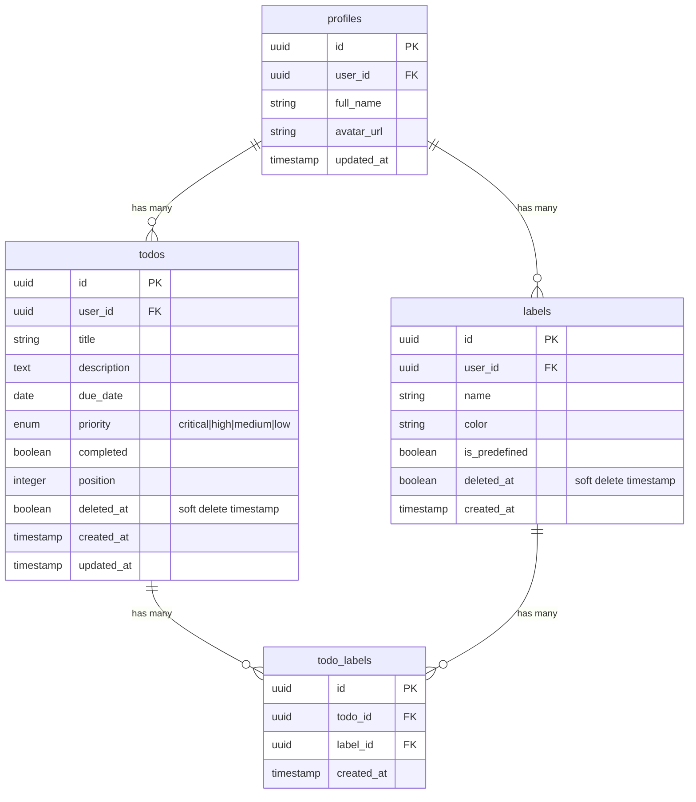
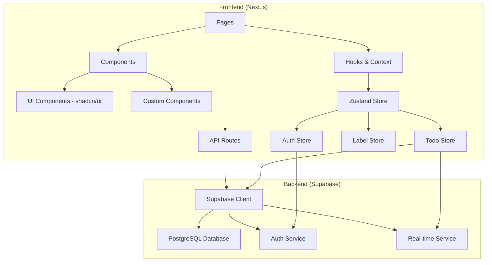
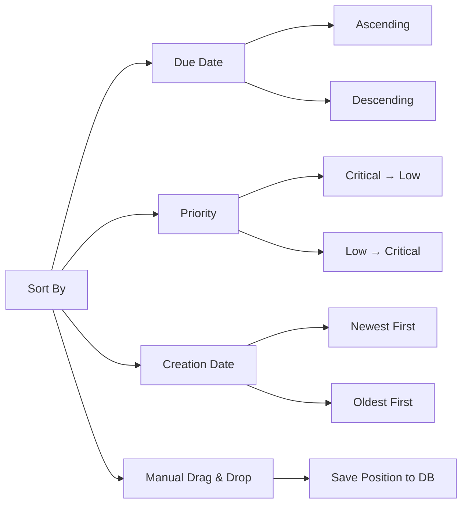
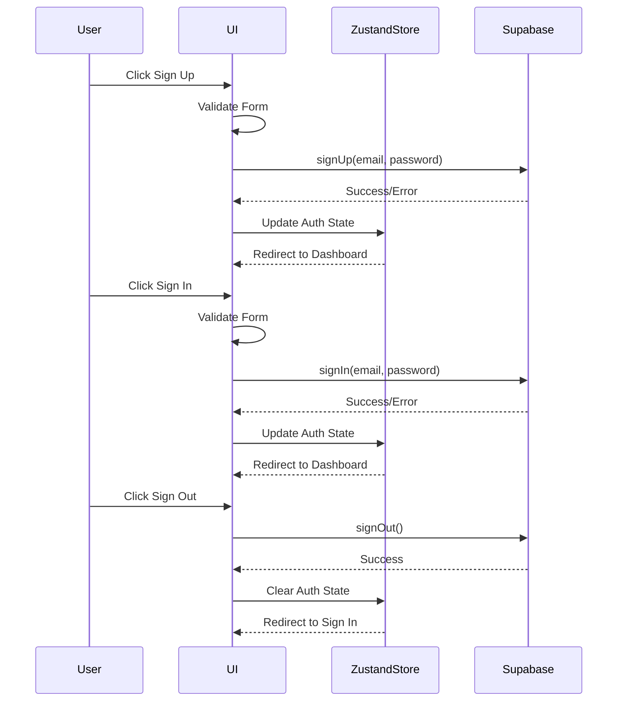

# Todo List Application - Architecture Plan

## Project Overview

A full-stack todo list application built with **Next.js 14 (App Router)**, **Supabase** for backend (database & authentication), and **shadcn/ui** for UI components.

### Key Features
- **Authentication**: Email/password sign-up, sign-in, sign-out
- **Priority Flags**: Critical, High, Medium, Low (4 levels with color coding)
- **Labels**: Predefined + Custom labels with color coding
- **Sorting**: By due date, priority, creation date, and manual drag-and-drop
- **Real-time Updates**: Live sync across devices

---

## Tech Stack

| Layer | Technology | Purpose |
|-------|-----------|---------|
| Frontend | Next.js 14 (App Router) | React framework with SSR, API routes |
| UI Library | shadcn/ui + Tailwind CSS | Modern, accessible components |
| State Management | Zustand | Global state for auth and todos |
| Drag & Drop | @dnd-kit/core | Manual reordering |
| Backend | Supabase | Database, Authentication, Real-time |
| Database | PostgreSQL (via Supabase) | Relational data storage |
| Forms | React Hook Form + Zod | Form validation |
| Type Safety | TypeScript | Type safety across the app |

---

## Database Schema



### Table Details

#### `profiles` Table
| Column | Type | Description |
|--------|------|-------------|
| id | uuid | Primary key (references auth.users) |
| user_id | uuid | Foreign key to auth.users |
| full_name | text | User's display name |
| avatar_url | text | Profile picture URL |
| updated_at | timestamp | Last update timestamp |

#### `todos` Table
| Column | Type | Description |
|--------|------|-------------|
| id | uuid | Primary key |
| user_id | uuid | Foreign key to profiles |
| title | text | Todo title (required) |
| description | text | Todo description (optional) |
| due_date | date | Due date (optional) |
| priority | enum | critical, high, medium, low |
| completed | boolean | Completion status |
| position | integer | For manual ordering |
| deleted_at | timestamp | Soft delete timestamp (null if not deleted) |
| created_at | timestamp | Creation timestamp |
| updated_at | timestamp | Last update timestamp |

#### `labels` Table
| Column | Type | Description |
|--------|------|-------------|
| id | uuid | Primary key |
| user_id | uuid | Foreign key to profiles |
| name | text | Label name |
| color | text | Hex color code |
| is_predefined | boolean | System vs user-created |
| deleted_at | timestamp | Soft delete timestamp (null if not deleted) |
| created_at | timestamp | Creation timestamp |

#### `todo_labels` Table (Junction)
| Column | Type | Description |
|--------|------|-------------|
| id | uuid | Primary key |
| todo_id | uuid | Foreign key to todos |
| label_id | uuid | Foreign key to labels |
| created_at | timestamp | Creation timestamp |

---

## Database Indexes

### Performance Optimization Indexes

```sql
-- Indexes for todos table
CREATE INDEX idx_todos_user_id ON todos(user_id);
CREATE INDEX idx_todos_user_id_deleted_at ON todos(user_id) WHERE deleted_at IS NULL;
CREATE INDEX idx_todos_priority ON todos(user_id, priority) WHERE deleted_at IS NULL;
CREATE INDEX idx_todos_due_date ON todos(user_id, due_date) WHERE deleted_at IS NULL;
CREATE INDEX idx_todos_created_at ON todos(user_id, created_at DESC) WHERE deleted_at IS NULL;
CREATE INDEX idx_todos_position ON todos(user_id, position) WHERE deleted_at IS NULL;
CREATE INDEX idx_todos_completed ON todos(user_id, completed) WHERE deleted_at IS NULL;

-- Indexes for labels table
CREATE INDEX idx_labels_user_id ON labels(user_id);
CREATE INDEX idx_labels_user_id_deleted_at ON labels(user_id) WHERE deleted_at IS NULL;
CREATE INDEX idx_labels_name ON labels(user_id, name) WHERE deleted_at IS NULL;

-- Indexes for todo_labels junction table
CREATE INDEX idx_todo_labels_todo_id ON todo_labels(todo_id);
CREATE INDEX idx_todo_labels_label_id ON todo_labels(label_id);
CREATE UNIQUE INDEX idx_todo_labels_unique ON todo_labels(todo_id, label_id);

-- Indexes for profiles table
CREATE INDEX idx_profiles_user_id ON profiles(user_id);
```

---

## Application Architecture



---

## Project Structure

```
todo-app/
├── app/
│   ├── (auth)/
│   │   ├── sign-in/
│   │   │   └── page.tsx
│   │   ├── sign-up/
│   │   │   └── page.tsx
│   │   └── layout.tsx
│   ├── (dashboard)/
│   │   ├── dashboard/
│   │   │   └── page.tsx
│   │   ├── labels/
│   │   │   └── page.tsx
│   │   ├── settings/
│   │   │   └── page.tsx
│   │   └── layout.tsx
│   ├── api/
│   │   └── supabase/
│   │       └── config/route.ts
│   ├── layout.tsx
│   └── page.tsx
├── components/
│   ├── ui/                    # shadcn/ui components
│   │   ├── button.tsx
│   │   ├── input.tsx
│   │   ├── dialog.tsx
│   │   ├── badge.tsx
│   │   └── ...
│   ├── todo/
│   │   ├── TodoItem.tsx
│   │   ├── TodoList.tsx
│   │   ├── TodoForm.tsx
│   │   ├── PriorityBadge.tsx
│   │   └── LabelBadge.tsx
│   ├── label/
│   │   ├── LabelManager.tsx
│   │   ├── LabelPicker.tsx
│   │   └── LabelForm.tsx
│   ├── SortDropdown.tsx
│   ├── FilterBar.tsx
│   └── ThemeToggle.tsx
├── lib/
│   ├── supabase/
│   │   ├── client.ts
│   │   ├── server.ts
│   │   └── types.ts
│   ├── db/
│   │   ├── todos.ts
│   │   └── labels.ts
│   ├── hooks/
│   │   ├── useAuth.ts
│   │   ├── useTodos.ts
│   │   └── useLabels.ts
│   └── utils.ts
├── stores/
│   ├── authStore.ts
│   ├── todoStore.ts
│   └── labelStore.ts
├── middleware.ts
├── .env.local
└── package.json
```

---

## Optimistic UI Pattern

Optimistic updates will be implemented using Zustand stores with the following pattern:

```typescript
// Example: Optimistic Todo Update
const updateTodo = async (id: string, updates: Partial<Todo>) => {
  // 1. Optimistically update local state
  setOptimisticUpdate(id, updates);
  
  try {
    // 2. Make API call
    await supabase.from('todos').update(updates).eq('id', id);
    
    // 3. Confirm update (remove optimistic flag)
    confirmUpdate(id);
  } catch (error) {
    // 4. Rollback on error
    rollbackUpdate(id);
    throw error;
  }
};
```

### Optimistic UI Features
- **Create Todo**: Show new todo immediately, sync to DB in background
- **Update Todo**: Update UI instantly, persist to DB
- **Delete Todo**: Soft delete with animation, then sync
- **Toggle Complete**: Immediate checkbox response
- **Reorder**: Instant drag feedback, save positions in batch
- **Add/Remove Labels**: Instant visual feedback

---

## Priority System

| Priority | Color | Visual |
|----------|-------|--------|
| Critical | Red | 🔴 |
| High | Orange | 🟠 |
| Medium | Yellow | 🟡 |
| Low | Blue | 🔵 |

---

## Predefined Labels

| Label | Color |
|-------|-------|
| Work | Blue (#3B82F6) |
| Personal | Green (#22C55E) |
| Shopping | Purple (#A855F7) |
| Health | Red (#EF4444) |
| Urgent | Orange (#F97316) |
| Ideas | Pink (#EC4899) |

---

## Sorting Options



---

## Authentication Flow



---

## RLS (Row Level Security) Policies

### Profiles Table
- `SELECT`: Users can read their own profile
- `UPDATE`: Users can update their own profile

### Todos Table
- `SELECT`: Users can read their own non-deleted todos
- `INSERT`: Users can create todos for themselves
- `UPDATE`: Users can update their own todos
- `DELETE`: Users can soft delete their own todos (set deleted_at)

### Labels Table
- `SELECT`: Users can read their own non-deleted labels + predefined labels
- `INSERT`: Users can create their own labels
- `UPDATE`: Users can update their own labels
- `DELETE`: Users can soft delete their own labels (set deleted_at, not predefined)

### Todo_Labels Table
- `SELECT`: Users can read labels for their non-deleted todos
- `INSERT`: Users can add labels to their todos
- `DELETE`: Users can remove labels from their todos

---

## Environment Variables

```env
# Supabase
NEXT_PUBLIC_SUPABASE_URL=your_supabase_project_url
NEXT_PUBLIC_SUPABASE_ANON_KEY=your_supabase_anon_key
```

---

## Key Dependencies

```json
{
  "dependencies": {
    "@supabase/supabase-js": "^2.39.0",
    "@dnd-kit/core": "^6.1.0",
    "@dnd-kit/sortable": "^8.0.0",
    "@dnd-kit/utilities": "^3.2.2",
    "zustand": "^4.4.7",
    "react-hook-form": "^7.49.0",
    "zod": "^3.22.0",
    "@hookform/resolvers": "^3.3.0",
    "date-fns": "^3.0.0",
    "clsx": "^2.0.0",
    "tailwind-merge": "^2.2.0",
    "lucide-react": "^0.300.0"
  }
}
```

---

## Implementation Phases

1. **Phase 1**: Project Setup & Supabase Configuration
2. **Phase 2**: Database Schema, Indexes & RLS Policies
3. **Phase 3**: Zustand Store Setup (Auth, Todo, Label)
4. **Phase 4**: Authentication Flow
5. **Phase 5**: Core CRUD Operations with Optimistic UI
6. **Phase 6**: UI Components Development
7. **Phase 7**: Sorting & Filtering Features
8. **Phase 8**: Drag & Drop Reordering with Optimistic Updates
9. **Phase 9**: Real-time Updates
10. **Phase 10**: Testing & Refinement
11. **Phase 11**: Documentation
